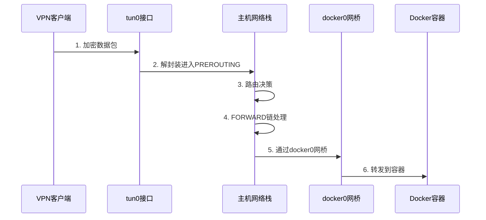

# 隧道接口与Docker网桥通信分析集成方案

## 概述

本文档描述了基于项目代码的隧道接口与Docker网桥通信分析集成方案的实现。该方案扩展了现有的iptables管理系统，增加了对tunnel虚拟网卡(tun/tap)与Docker网桥之间网络通信的深度分析功能。

## 功能特性

### 1. 隧道接口分析
- **接口识别**: 自动识别系统中的tun/tap隧道接口
- **配置解析**: 解析隧道接口的本地地址、对端地址、MTU等配置信息
- **流量统计**: 实时获取接口的收发包数、字节数、错误统计等信息
- **规则关联**: 分析与隧道接口相关的iptables规则

### 2. Docker网桥分析
- **网桥发现**: 自动发现docker0和自定义网桥(br-前缀)
- **容器关联**: 识别连接到网桥的容器信息
- **网络配置**: 获取网桥的子网、网关等网络配置
- **隔离规则**: 分析Docker自动创建的隔离规则

### 3. 通信路径分析
- **数据流跟踪**: 完整跟踪数据包从隧道接口到Docker容器的传输路径
- **规则匹配**: 识别数据包在各个iptables链中的处理规则
- **性能统计**: 统计转发包数、丢包数、字节传输量等指标
- **瓶颈识别**: 识别通信路径中的性能瓶颈和配置问题

### 4. 规则生成器
- **智能生成**: 根据用户配置自动生成通信规则
- **多种场景**: 支持双向通信、单向通信、特定协议等场景
- **NAT支持**: 自动生成MASQUERADE等NAT规则
- **日志功能**: 可选择性地添加日志记录规则

## 技术架构

### 后端架构

#### 1. 模型层扩展 (models/models.go)
```go
// 新增模型结构
- TunnelDockerAnalysis: 通信分析结果
- CommunicationStep: 通信路径步骤
- TunnelDockerStats: 统计信息
- TunnelInterfaceInfo: 隧道接口详细信息
- DockerBridgeInfo: Docker网桥详细信息
- NetworkCommunicationRule: 网络通信规则
```

#### 2. 服务层扩展 (services/network_service.go)
```go
// 新增服务方法
- GetTunnelInterfaceRules(): 获取隧道接口相关规则
- AnalyzeTunnelDockerCommunication(): 分析通信路径
- GetTunnelInterfaceInfo(): 获取隧道接口详细信息
- generateCommunicationPath(): 生成通信路径
- calculateTunnelDockerStats(): 计算统计信息
```

#### 3. 控制器层 (controllers/tunnel_controller.go)
```go
// REST API端点
- GET /api/tunnel/interfaces: 获取隧道接口列表
- GET /api/tunnel/docker-bridges: 获取Docker网桥列表
- GET /api/tunnel/{interface}/rules: 获取接口相关规则
- GET /api/tunnel/{interface}/info: 获取接口详细信息
- GET /api/tunnel/analyze-communication: 分析通信路径
- POST /api/tunnel/generate-rules: 生成通信规则
```

### 前端架构

#### 1. 组件设计 (components/TunnelAnalysis.vue)
- **接口选择器**: 隧道接口和Docker网桥选择
- **信息展示**: 接口详细信息和统计数据
- **路径可视化**: 通信路径步骤展示
- **规则管理**: 相关规则列表和生成器
- **统计图表**: 流量统计和性能指标

#### 2. 路由配置
- 路由路径: `/tunnel-analysis`
- 菜单集成: 侧边栏"隧道分析"菜单项
- 页面标题: "隧道接口分析"

## 数据流分析

### 1. tun0访问Docker容器的完整流程



### 2. 关键iptables处理点

| 处理阶段 | 表 | 链 | 作用 | 接口参数 |
|---------|---|----|----|---------|
| 连接跟踪 | raw | PREROUTING | 初始化连接跟踪 | -i tun0 |
| 地址转换 | nat | PREROUTING | DNAT规则处理 | -i tun0 |
| 转发过滤 | filter | FORWARD | 转发规则检查 | -i tun0 -o docker0 |
| 源地址转换 | nat | POSTROUTING | MASQUERADE处理 | -o tun0 |

## API接口文档

### 1. 获取隧道接口列表
```http
GET /api/tunnel/interfaces
Authorization: Bearer <token>

Response:
{
  "success": true,
  "tunnel_interfaces": [
    {
      "name": "tun0",
      "type": "tunnel",
      "state": "UP",
      "ip_addresses": ["192.168.252.1"],
      "statistics": {
        "rx_bytes": 8572081,
        "tx_bytes": 131373159,
        "rx_packets": 77897,
        "tx_packets": 149531
      }
    }
  ],
  "count": 1
}
```

### 2. 分析通信路径
```http
GET /api/tunnel/analyze-communication?tunnel_interface=tun0&docker_bridge=docker0
Authorization: Bearer <token>

Response:
{
  "success": true,
  "analysis": {
    "tunnel_interface": "tun0",
    "docker_bridge": "docker0",
    "forward_rules": [...],
    "nat_rules": [...],
    "communication_path": [
      {
        "step": 1,
        "description": "数据包从tun0接口进入",
        "table": "raw",
        "chain": "PREROUTING",
        "action": "连接跟踪初始化"
      }
    ],
    "statistics": {
      "tunnel_to_docker_packets": 1234,
      "docker_to_tunnel_packets": 5678,
      "forwarded_packets": 6912,
      "dropped_packets": 0
    },
    "recommendations": [
      "建议添加允许tun0到docker0的转发规则"
    ]
  }
}
```

### 3. 生成通信规则
```http
POST /api/tunnel/generate-rules
Authorization: Bearer <token>
Content-Type: application/json

{
  "tunnel_interface": "tun0",
  "docker_bridge": "docker0",
  "direction": "bidirectional",
  "protocol": "all",
  "action": "ACCEPT",
  "enable_nat": true,
  "enable_logging": false
}

Response:
{
  "success": true,
  "generated_rules": [
    "iptables -A FORWARD -i tun0 -o docker0 -j ACCEPT",
    "iptables -A FORWARD -i docker0 -o tun0 -m conntrack --ctstate RELATED,ESTABLISHED -j ACCEPT",
    "iptables -t nat -A POSTROUTING -o tun0 -j MASQUERADE"
  ],
  "rules_count": 3
}
```

## 使用指南

### 1. 基本使用流程

1. **访问隧道分析页面**: 在侧边栏点击"隧道分析"菜单
2. **选择网络接口**: 从下拉列表中选择隧道接口和Docker网桥
3. **查看接口信息**: 系统自动显示选中接口的详细信息和统计数据
4. **分析通信路径**: 点击"分析通信路径"按钮获取完整的数据流分析
5. **生成通信规则**: 使用规则生成器创建所需的iptables规则

### 2. 高级功能

#### 通信路径可视化
- **步骤展示**: 以时间线形式展示数据包处理的每个步骤
- **规则详情**: 查看每个处理阶段涉及的具体iptables规则
- **性能指标**: 实时显示包转发统计和性能数据

#### 规则生成器
- **灵活配置**: 支持多种通信方向、协议和动作配置
- **NAT支持**: 自动处理网络地址转换需求
- **一键复制**: 生成的规则可一键复制到剪贴板

### 3. 故障排查

#### 常见问题及解决方案

1. **隧道接口未显示**
   - 检查接口是否存在: `ip addr show`
   - 确认接口类型正确: 必须是tun或tap接口

2. **通信分析失败**
   - 验证接口状态: 确保接口处于UP状态
   - 检查权限: 确保后端服务有执行iptables命令的权限

3. **规则不生效**
   - 检查规则顺序: iptables规则按顺序匹配
   - 验证接口名称: 确保生成的规则中接口名称正确

## 性能优化

### 1. 后端优化
- **缓存机制**: 对频繁查询的接口信息进行缓存
- **并发处理**: 使用goroutine并发获取多个接口的信息
- **错误处理**: 完善的错误处理和日志记录

### 2. 前端优化
- **懒加载**: 按需加载接口详细信息
- **数据缓存**: 缓存已获取的分析结果
- **响应式设计**: 适配不同屏幕尺寸

## 安全考虑

### 1. 权限控制
- **API认证**: 所有API端点都需要有效的JWT令牌
- **命令执行**: 后端服务需要适当的系统权限执行iptables命令
- **输入验证**: 严格验证用户输入的接口名称和参数

### 2. 数据安全
- **敏感信息**: 避免在日志中记录敏感的网络配置信息
- **访问控制**: 限制对系统网络配置的访问权限

## 扩展计划

### 1. 功能扩展
- **IPv6支持**: 扩展对IPv6网络的分析支持
- **实时监控**: 添加实时流量监控和告警功能
- **历史数据**: 保存和分析历史通信数据
- **自动优化**: 基于分析结果自动优化规则配置

### 2. 集成扩展
- **容器编排**: 集成Kubernetes网络分析
- **监控系统**: 集成Prometheus/Grafana监控
- **日志分析**: 集成ELK栈进行日志分析

## 总结

本集成方案成功扩展了现有的iptables管理系统，增加了对隧道接口与Docker网桥通信的深度分析能力。通过完整的后端API和直观的前端界面，用户可以轻松地分析复杂网络环境中的数据流向，生成所需的iptables规则，并获得优化建议。

该方案不仅提供了强大的分析功能，还保持了与现有系统的良好集成，为网络管理员提供了一个专业级的网络分析工具。